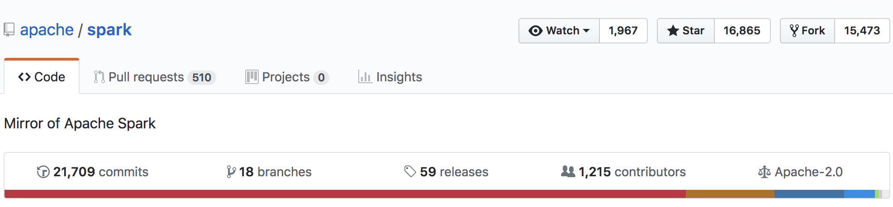
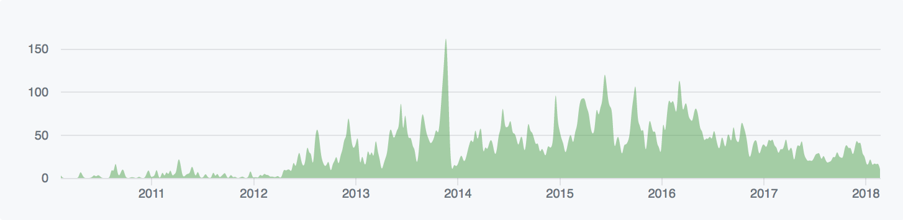

# DSLab Week 7
## Getting Started with...

<p style="text-align: center;">
    <a title="By Apache software foundation (https://spark.apache.org/images/spark-logo.eps) [Apache License 2.0 (http://www.apache.org/licenses/LICENSE-2.0)], via Wikimedia Commons" href="https://commons.wikimedia.org/wiki/File:Apache_Spark_logo.svg">
        
    </a>
</p>

In this 3-week module, we will investigate how to scale up analysis to a cluster of machines using
the [Apache Spark](http://spark.apache.org) distributed computing framework.


## Who am I?

* Rok Roškar
* PhD in Astrophysics
* I currently work on the SDSC Platform team at ETH Zürich
* used Spark extensively in previous job for various academic projects


## What is Spark?

### "a general-purpose distributed computation framework"

a few key features:

* interactive data exploration
* keeps data in-memory - good for loop-intensive algorithms

where is it being used?

* mostly internet applications (recommendation engines, usage analysis etc.)
* classic Big Data use cases e.g. text analysis
* some academia, notably neuroscience


### Project stats





## Why use Spark?

Spark is just one solution that facilitates analysis on large data.

Other options:

* using the Message Passing Interface (MPI) library
* similar frameworks e.g. [Apache Flink](https://flink.apache.org/) (more streaming-specific)
* Python-specific [Dask](https://dask.pydata.org) (nice abstraction for scaling python-native applications)

Sometimes being clever delivers the best results...


## Flexibility of Spark runtime

Spark's flexibility is what makes it so popular.

The spark runtime can be deployed on:
* a single machine (local)
* a set of pre-defined machines (stand-alone)
* a dedicated Hadoop-aware scheduler (YARN/Mesos )
* "cloud", e.g. Amazon EC2


## Incremental and interactive development

The development workflow is that you start small (local) and scale up to one of the other solutions, depending on your needs and resources.

In addition, you can run applications on any of these platforms either

* interactively through a shell (or a Jupyter notebook as we'll see)
* batch mode

<p style="text-align: center;"><em><strong>No code changes to go between these methods of deployment!</em></strong></p>


## Spark Architecture Overview


### The things that make distributed computing hard:

1. distributing work to the available resources
2. orchestrating task execution
3. collecting results

This is what a "framework" like Spark does for us

At its most basic, it consists of a **driver** and **workers**


<!-- .slide: data-background="figs/spark_architecture.svg" data-background-size="contain" -->


<!-- .slide: data-background="figs/spark_architecture.svg" data-background-size="contain" data-state="background-blur-animation"-->
**Driver**

* coordinates the work to be done
* keeps track of tasks
* collects metrics about the tasks (disk IO, memory, etc.)
* communicates with the workers (and the user)


<!-- .slide: data-background="figs/spark_architecture.svg" data-background-size="contain" data-state="background-blur-animation"-->
**Workers**

* receive tasks to be done from the driver
* store data in memory or on disk
* perform calculations
* return results to the driver

The user's access point to this Spark universe is the **Spark Context** which provides an interface to generate RDDs.


## Basic Data Abstraction:
## the RDD (Resilient Distributed Dataset)

<p style="text-align: center;">An RDD is the primary interface and cornerstone of every Spark application.</p>

* keeps track of data distribution across the workers <!-- .element: class="fragment" data-fragment-index="1" -->
* provides an interface to the user to access and operate on the data <!-- .element: class="fragment" data-fragment-index="1" -->
* can rebuild data upon failure <!-- .element: class="fragment" data-fragment-index="1" -->
* keeps track of lineage <!-- .element: class="fragment" data-fragment-index="1" -->
* is immutable <!-- .element: class="fragment" data-fragment-index="1" -->

<p style="text-align: center;"><strong>As a Spark user, you write applications that feed data into RDDs and subsequently transform them into something useful</strong></p>
<!-- .element: class="fragment" data-fragment-index="2" -->


<!-- .slide: data-background="figs/parallelize.svg" data-background-size="contain" -->


## RDD transformations and actions

Once an RDD is created, it is **immutable** - it can only be transformed into
a new RDD via a *transformation*.

A transformation, however, does not trigger any computation, only updates the
DAG.

Calculations are triggered by *actions*.


## Transformations

* `distinct`: only retain the unique elements of the entire RDD
* `filter`: only keep those elements for which the filter function evaluates to `True`
* `flatMap`: returns a number of items different from the original data
* `map`: the most basic transformation with 1:1 correspondence to original data
* `mapPartitions`: similar to `map` but done on a per-partition basis
  (requires a generator function)
* `reduceByKey`: group elements by key and keep the data distributed
* `sortBy`: sort using the provided function

Transformations are evaluated "lazily" - only executed once an *action* is performed.


<!-- .slide: data-background="figs/map_example.svg" data-background-size="contain"-->


<!-- .slide: data-background="figs/flatMap_example.svg" data-background-size="contain"-->


<!-- .slide: data-background="figs/filter_example.svg" data-background-size="contain"-->


<!-- .slide: data-background="figs/reduceByKey_example.svg" data-background-size="contain"-->


## Actions
* `collect`: pulls all elements of the RDD to the driver (often a bad idea!!)
* `collectAsMap`: like `collect` but returns a dictionary for key/value RDDs
* `countByKey`/`countByValue`
* `first`: returns the first element of the RDD to the driver
* `reduce`: reduces the entire RDD to a single value
* `take`: yields a desired number of items to the driver

<h4><p style="text-align: center;">Don't worry, you will soon get to practice
with most of these!</p></h4>
<!-- .element: class="fragment" data-fragment-index="1" -->


## Lineage

* When an RDD is transformed, this **transformation** is not automatically
  carried out.
* Instead, the system remembers how to get from one RDD to another and only
  executes whatever is needed for the **action** that is being done.
* this allows one to build up a complex "pipeline" and easily tweak/rerun it
  in its entirety


### Initializing Spark
```python
import pyspark

sc = pyspark.SparkContext()
```

This step launches the Spark runtime and connects the application to the
master. This creates a driver which can now be used to dispatch work to the
resources allocated for the application.


### Parallelize
```python
rdd = sc.parallelize(data)
```
<p style="text-align: center;">
    
</p>


### map
```python
def square(x):
    return x*x

rdd = sc.parallelize(data)
rdd_squared = rdd.map(square)
```
<p style="text-align: center;">
    
</p>


## Caching

* RDD evalutations are *lazy*
* whenever an action is performed, the entire lineage graph is recalculated
* unless! an intermediate RDD is cached -- then it is only calculated once and reused from memory each subsequent time
* this allows for good performance when iterating on an RDD is required


```python
rdd = sc.parallelize(data)
rdd2 = rdd.map(square)
rdd2.cache()
```


```python
rdd = sc.parallelize(data)
rdd2 = rdd.map(square)
rdd2.cache()
rdd3 = rdd2.map()
```


## Partitioning

* data of each RDD is partitioned and each partition is assigned to an executor
* each partition in a transformation results in a task
* there may be many more tasks than cores in the system, which allows for good utilization by fine-graining the overall load.


#### Time for the basic Spark tutorial!

Head to the gitlab repo for this week:

https://git-dslab.epfl.ch/dslab2018/week7-intro-to-spark

Follow the instructions in the `README.md` to get set up.


## Lab notebooks

Three notebooks for this week in the `notebooks/` directory. Should be done in
this order:

1. `python-refresher.ipynb`
2. `spark-intro.ipynb`
3. `gutenberg.ipynb`


## Analyzing the Gutenberg corpus

The [Gutenberg Project](http://http://www.gutenberg.org/) is a large free
repository of books and other media in different languages (but primarily
English)

We will use it to do some basic text analysis using key/value PairRDDs in Spark.


## The data

I have pre-processed the data already and created an RDD for you to use. The
RDD consisting of `(ID, text)` key-value pairs can be found in

```
hdfs:///datasets/gutenberg/gutenberg_rdd
```

This RDD will form the basis of the work in the notebook.


## The goal

The eventual goal is to produce something like the [Google NGram
viewer](https://books.google.com/ngrams), but for the Gutenberg corpus.
Because the notebook is quite long, the last part of the notebook is already
filled in, but feel free to run it!
